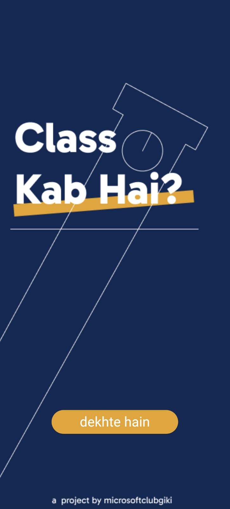
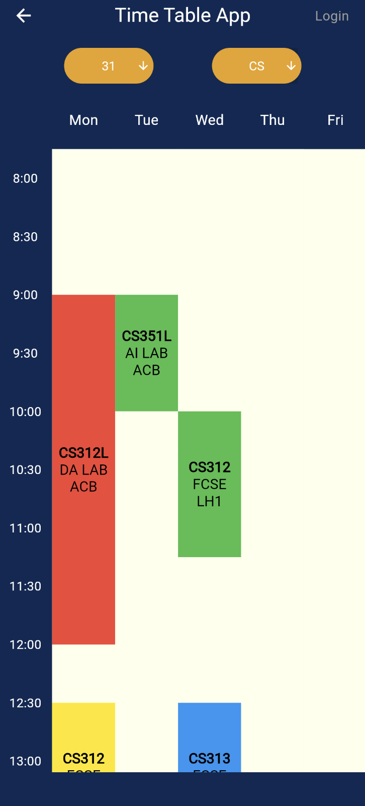
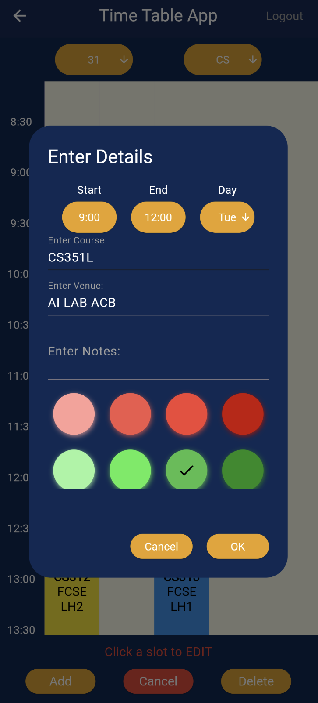

# Time Table App

The idea behind this project is to provide a digital solution for fixing GIK Institute's timetable problem. Class representatives will have the ability to modify timetables of their sections, while the rest of the students can view the latest timetable and be notified of any changes.

The app can be customized for other educational institutions with minor changes. 

## Features

- **Interactive UI**: View your timetable in a grid format with color-coded slots.
- **User-Friendly Interface**: Time axis is kept vertical to properly utilize a smartphone's aspect ratio.
- **Section-Wise Timetables**: Each section has its own timetable, allowing for easier navigation.
- **Responsive Design**: Works seamlessly across different screen sizes.
- **Synchronized Data**: The backend is deployed so all changes are synchronized in real-time. 
- **Clash Detection**: The app will not let you add a slot that conflicts with an existing one.

## Tech Stack
- **Frontend**: Flutter
- **Database**: Firebase
- **Backend**: Flask
- **Hosting**: Vercel

## Screenshots
<div align="center">
    
    
</div>
<div align="center">
    
    
</div>


## Getting Started

To run this project locally:

1. Clone the repository:
   ```bash
   git clone <repository-url>
   ```
2. Navigate to the project directory:
   ```bash
   cd Time-Table-App
   ```
3. Install dependencies:
   ```bash
   flutter pub get
   ```
4. Run the app:
   ```bash
   flutter run
   ```

## Future Enhancements

- Add support for exporting timetables as PDFs.
- Implement user authentication with role-based access.
- Introduce notifications for upcoming classes or events.

Feel free to contribute to this project or suggest improvements!
